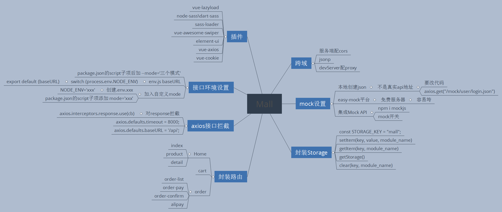
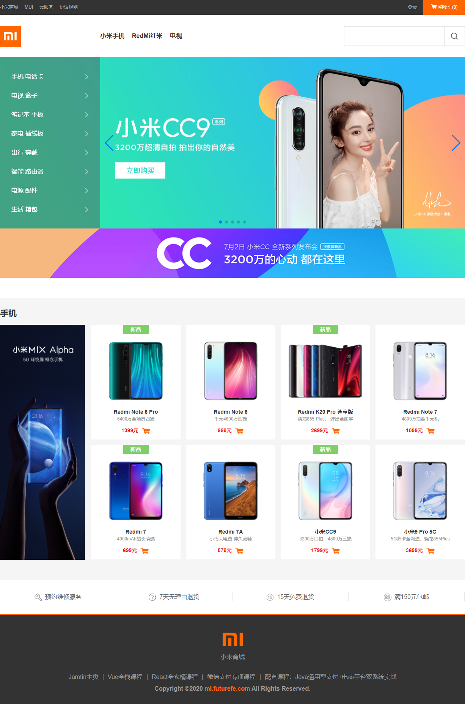
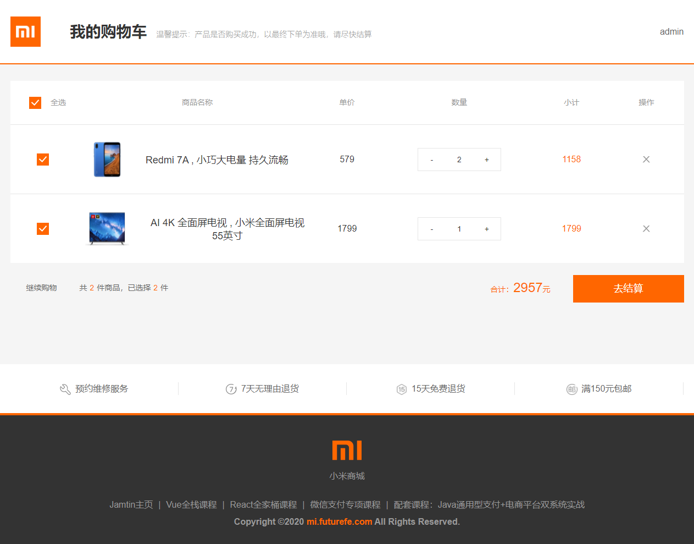

# MiMall
Vue全家桶高仿小米商城

演示地址：http://182.61.57.143/   账号：admin  密码：admin

```bash
# 安装相关依赖
npm install

# 运行项目，在本地浏览器访问http://localhost:8080/
npm run serve
```


### 使用插件

- vue-lazyload
- element-ui
- node-sass/dart-sass
- sass-loader
- vue-awesome-swiper
- vue-axios
- vue-cookie




效果图：






